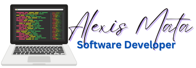

 

# 👨‍💻 ¡Hola, soy **Alexis Eduardo Mata**!  
Soy un **desarrollador Laravel FullStack** apasionado por construir aplicaciones web escalables, seguras y modernas. Me encanta transformar ideas en código funcional y eficiente 💡.

---

## 🛠️ ¿Qué hago?

Desarrollo soluciones completas desde el backend hasta el frontend utilizando tecnologías como:

- **Backend**: Laravel, PHP 8+, MySQL, SQL Server, PostgreSQL, REST APIs
- **Frontend**: Blade, TailwindCSS, Alpine.js, Vue.js, React
- **DevOps & Tools**: Docker, Git & GitHub, Composer, NPM, Artisan CLI
- **POO & Arquitectura**: Patrones de diseño, SOLID, Clean Code, MVC, Repositorios
- **Testing**: PHPUnit, TDD/BDD

---

## 🧱 Mis fortalezas en Laravel

Laravel es mi framework favorito porque me permite construir aplicaciones robustas con elegancia y productividad:

- Autenticación y autorización (Policies, Gates)
- Eloquent ORM y Query Builder
- Migraciones, Seeders y Factories
- Colas, eventos, notificaciones y broadcasting
- Livewire y Jetstream / Filament para interfaces modernas
- Integración con APIs externas y microservicios

---

## 🧪 Buenas prácticas que sigo

- Uso de principios SOLID y clean code
- Desarrollo basado en pruebas (TDD)
- Arquitectura escalable y mantenible
- Optimización de consultas y uso correcto de índices
- Seguridad: validaciones, CSRF, XSS, inyección SQL, etc.

---

## 🌐 En mi ruta de aprendizaje en el Frontend, estoy aprendiendo y trabajando con:

### ✅ React
- Componentes funcionales y hooks
- Context API y Zustand para manejo de estado
- Next.js para aplicaciones SSR/SSG
- TailwindCSS y Styled Components

### ✅ Vue.js
- Vue 3 + Composition API
- Vuex para manejo global del estado
- Vue Router y Vite
- Nuxt 3 para aplicaciones universales

Estoy constantemente mejorando mis habilidades frontend para ofrecer interfaces dinámicas y responsivas.

---

## 🚀 Mi camino de aprendizaje

- Comencé con PHP básico y POO para entender bien los fundamentos.
- Pasé de escribir PHP Puros a frameworks como Laravel.
- Aprendí las bases y fundamentos de Laravel con cada proyecto real.
- Empecé a integrar frontend moderno con Vue y ahora también React.
- Muchos de los proyectos ha sido desarrollado de forma freelance.
- Puedo aprender la metodología Kanban/Scrum para el trabajo en equipo.
- Actualmente deseo explorar la integración con los servicios Cloud y las buenas prácticas CI/CD.

---

## 📚 Recursos que recomiendo

- [Documentación oficial de Laravel](https://laravel.com/docs )
- [Laracasts](https://laracasts.com/ )
- [Clean Code - Robert C. Martin](https://amzn.to/3xORWAP )
- [Vue Mastery](https://www.vuemastery.com/ )
- [React Docs](https://react.dev/ )

---

## 📬 ¡Hablemos!

Si tienes un proyecto interesante, quieres colaborar o simplemente intercambiar conocimientos, no dudes en contactarme:

📧 Email: [alexis.ed.mata@gmail.com]  
📱 LinkedIn: [Perfil en LinkedIn](https://www.linkedin.com/in/alexis-eduardo-mata/)]  
🐙 GitHub: [@Alexis79Bck2]

